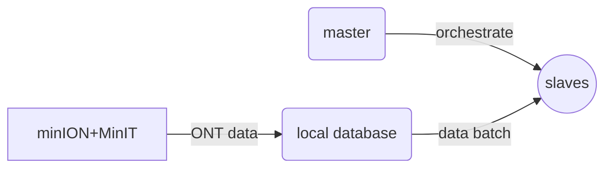

## f5n

Motivated from [f5p](https://github.com/hasindu2008/f5p) - we build a network of mobiles to process [ONT](https://nanoporetech.com/) data. The work is under construction! 

### Overview
f5n can run the following on ARM with Android API>22 [more details](https://hasindu2008.github.io/linux-tools-on-phone/)

 1. [minimap2](https://github.com/lh3/minimap2) sequence alignment
 2. [samtools](https://github.com/samtools/samtools) sort
 3. [samtools](https://github.com/samtools/samtools) index
 4. [f5c](https://github.com/hasindu2008/f5c) index
 5. [f5c](https://github.com/hasindu2008/f5c) call-methylation
 6. [f5c](https://github.com/hasindu2008/f5c) event alignment

we build a standalone application and a cluster of nodes where a master orchestrates other nodes. 

in this way ONT data can be correct for errors in the field, on the fly!
